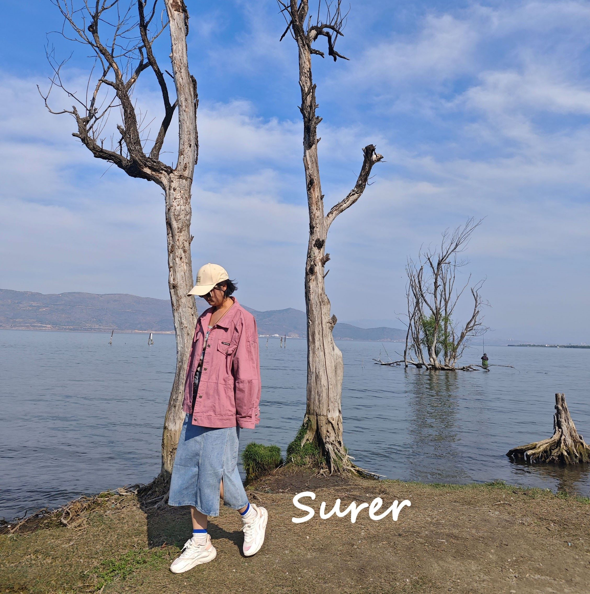
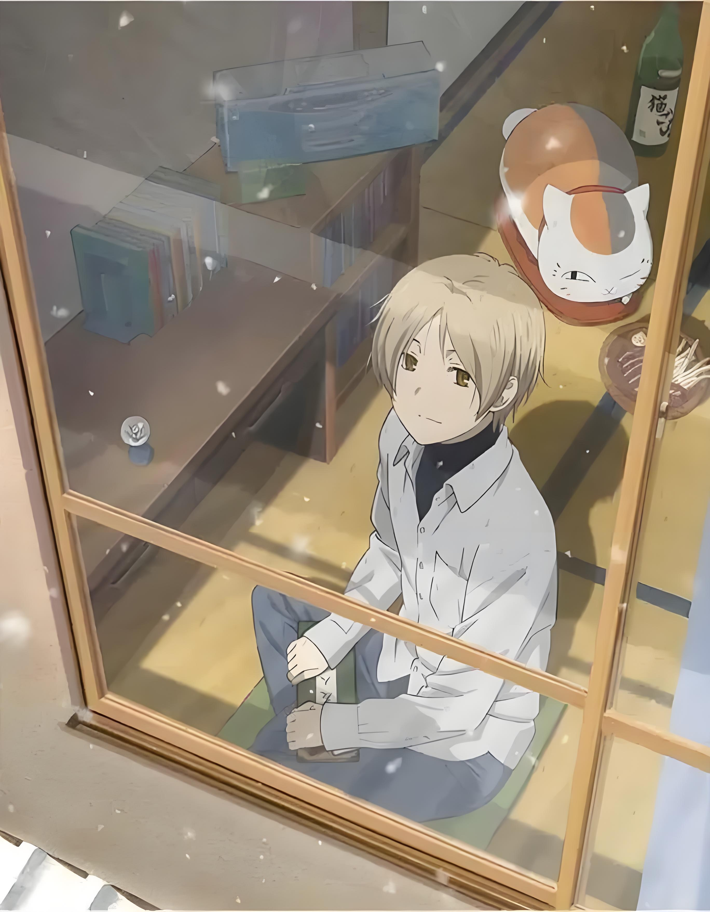
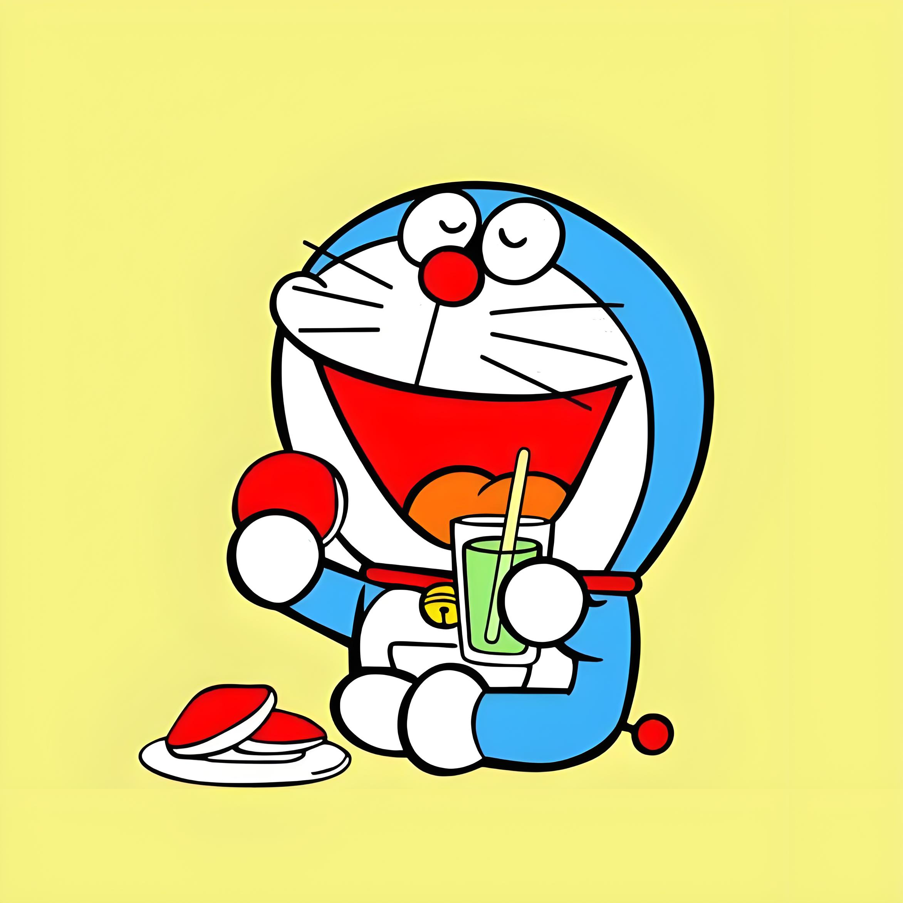
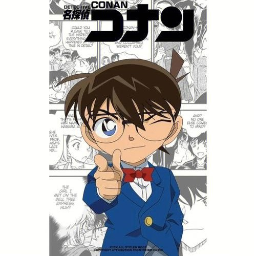
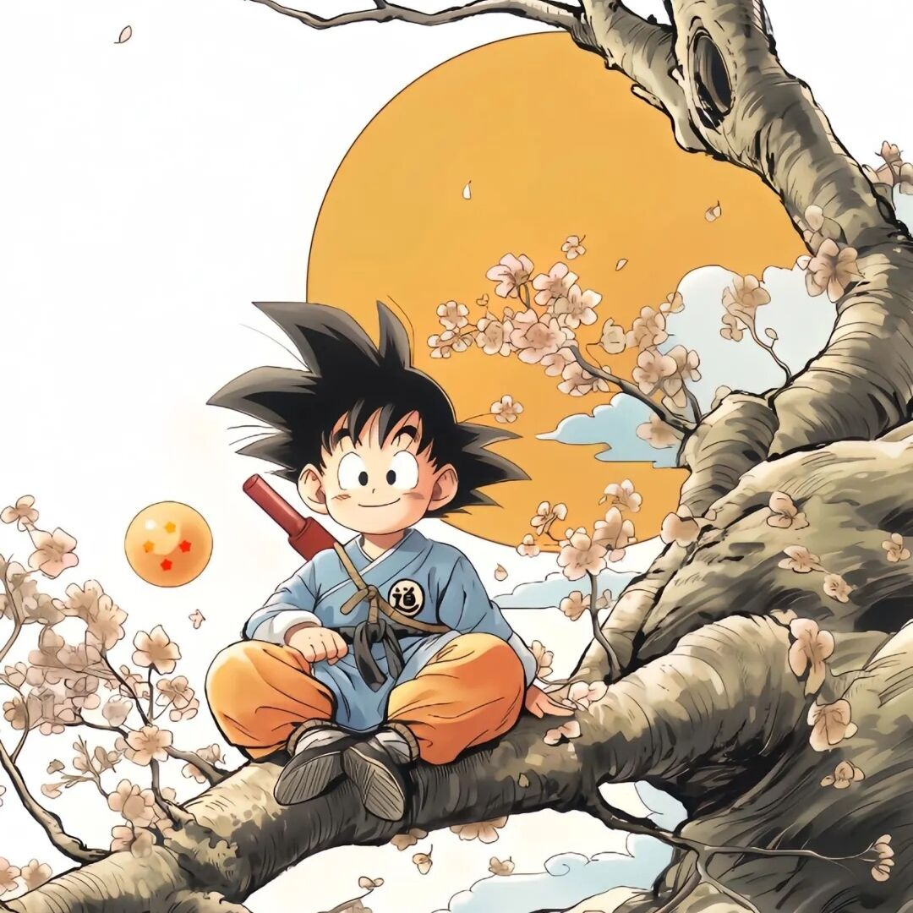

<!-- 在头部添加预加载关键资源 -->
<link rel="preload" href="img/surer.jpg" as="image" fetchpriority="high">
<link rel="preload" href="img/chaos.jpg" as="image">

  <!-- 左侧：文字内容 -->
  

    
Chaos & Surer

    

      
        Two Troublemakers' Zone Journey
        <svg width="400" height="18" class="header-underline" xmlns="http://www.w3.org/2000/svg">
          <path d="M8,12 Q38,18 68,12 Q98,6 128,12 Q158,18 188,12 Q218,6 248,12 Q278,18 308,12"
            stroke="#6ecbff" stroke-width="5" fill="none"
            stroke-linecap="round" stroke-linejoin="round"
            style="filter: blur(0.2px); opacity: 0.85;" />
        </svg>
      
    

    

      <a href="https://love.cscottage.top" target="_blank" class="header-btn">Home</a>
      <a href="mailto:weichaos111@outlook.com" class="header-btn">Contact me</a>
    

  

  <!-- 右侧：头像及光辉 -->
  

    

      

      

        
        
      

    

  

<!-- 移动端显示的标语 -->

  <h1>心之所向 素履以往</h1>

  加载中...

 

 

 

<!DOCTYPE html>
<html>

<head>
    <meta http-equiv="content-type" content="text/html; charset=utf-8">
    <meta name="viewport" content="width=device-width,initial-scale=1,maximum-scale=1,user-scalable=no">
    
</head>

    

        

            

                
            

            

                <h2><strong>抖音</strong></h2>
                
<a href="https://www.douyin.com/user/MS4wLjABAAAAXD3xE4ARhbdpqQvDvQPzN3oHenEyIBdWzGV5GYHRosqGUn8nvJuz1aoPVScoUCX1?from_tab_name=main&is_search=0&list_name=follow&nt=0"><strong>@是麦子呀</strong></a> 我的电子日记， 记录自己平凡的日常📷

            

        

        

            

                
            

            

                <h2><strong>抖音</strong></h2>
                
<a  href="https://www.douyin.com/user/MS4wLjABAAAA3shEtLqFq7-HiGjmUL-4t_qiv4qn_aGLh2VGj0Cj7tFDu7Bt5x-hbZ_VCyhDfA4Z?from_tab_name=main&is_search=0&list_name=follow&nt=0"><strong>@麦子黄了</strong></a> 不足道也的日常😋

            

        

        

            

                
            

            

                <h2><strong>知乎</strong></h2>
                
<a  href="https://www.zhihu.com/people/zhi-yi-73-45"><strong>@只一<strong></a> 自问自答~

            

        

        

            

                
            

            

                <h2><strong>哔哩哔哩</strong></h2>
                
<a  href="https://space.bilibili.com/2069187267/?spm_id_from=333.999.0.0"><strong>@一颗麦子呀</strong></a>  一个有态度的女生。记录自己重启人生找回生活的日常❤️

            

        

    

</html>