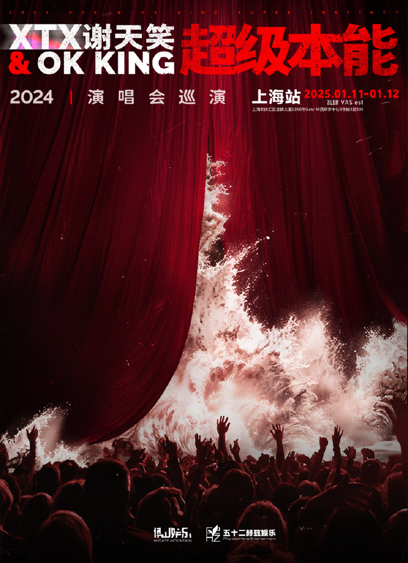

<!DOCTYPE html>
<html lang="zh-CN">
<head>
    <meta charset="UTF-8">
    <meta name="viewport" content="width=device-width, initial-scale=1.0">
    <title>纪念</title>
    <link rel="stylesheet" href="https://cdnjs.cloudflare.com/ajax/libs/font-awesome/6.4.0/css/all.min.css">
    
</head>

<body>
    

        

            

            

            

            

                <h class="h1">谢天笑&OK KING · 超级本能</h>
                
2024演唱会巡演 · 上海站

            

        

        <section class="concert-info">
            

                

                    

                        

                            <h2 class="ticket-title">超级本能</h2>
                            
谢天笑2024演唱会

                        

                        

                            

                                <h3><i class="fas fa-calendar-alt"></i> 日期</h3>
                                
2025年1月11日

                            

                            

                                <h3><i class="fas fa-map-marker-alt"></i> 地点</h3>
                                
瓦肆VAS est

                            

                        

                    

                

            

            

              

                    

                        
                    

                    
珍藏票根 · 永恒回忆

              

            

        </section>
        <section class="gallery-section">
            

                <h2>演唱会精彩瞬间</h2>
                
捕捉光芒闪耀的每一刻

            

            

                <!-- 相册图片 - 使用占位图，实际应用中替换为真实图片 -->
                

                    
                

                

                    
                

                

                    
                

                

                    
                

                

                    
                

                

                    
                

                

                    
                

                

                    
                

                

                    
                

                

                    
                

                

                    
                

                

                    
                

                

                    
                

                

                    
                

                

                    
                

                

                    
                

                

                    
                

                

                    
                

            

        </section>
        <!-- 模态框 -->
        

            &times;
            
            

        

        

            
© 2024谢天笑《超级本能》演唱会 | 纪念

        

    
 
    
</body>
</html>

